We are pleased to present Enterprise Lens 3.0.4

## Highlights

| [Default Illustration](#1-default-illustration)        | [Load from Excel](#2-load-from-excel)       | [Dynamic Associations](#3-dynamic-associations) |
| :----------------------------------------------------- | :------------------------------------------ | :---------------------------------------------- |
| [**Typewriter Mode**](#4-typewriter-mode)              | [**Lens Directories**](#5-lens-directories) | [**URL Links**](#6-url-links)                   |
| [**Multi-Edit**](#7-multi-edit)                        | [**Branding**](#8-branding)                 | [**Style Guide**](#9-style-guide)               |
| **[Enterprise Lens Codes](#10-enterprise-lens-codes)** |                                             |                                                 |

## 1. Default Illustration

There is a new default Illustration that is applied when you create **any** new Illustration.  This feature has been designed to assist users create a clean and professional interface to their Story.  It also incoroporates multiple new box types in the design with a layout to cater for all.  The twelve (12) default lenses have also been incorporated to the Illustration ensuring you have everything you need, out of the box, to create a quality Illustration in a short space of time.

### Story

There are 3 new stories included in the default Illustration.  Default, Front Cover and Default (Box Type) Canvas

**1. Default** 

**2. Front Cover**

**3. Default (Box Type) Canvas**

#### Default

This is the default setting and has no Box Types associated with it.  It is a holding Box Type ie the base Box Type for building other Box Types on top of and creating an Illustration.

#### Front Cover

There is a new Story titled `Front Cover` that is to be used for either internal or external presentations.  If the presentation is internal then simply replace the remove the left of right logo with your own logo and remove the other.  The initial layout is meant to have your logo in the left hand side and the customer logo on the right hand side.

The logos on this page need to be a URL reference from a secure site (i.e https:) or an image you have access to when demonstrating.

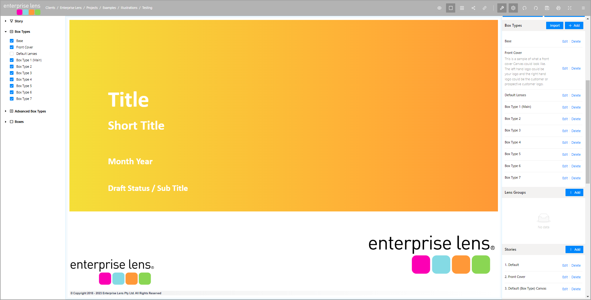

The logos on this page need to be a URL reference from a secure site (i.e https:) or an image you have access to.

Front Cover is simply designed to improve the initial appearance of your Illustration.  There is a new section in the default Style guide that lets you choose from several different color option, or equally create something yourself that may align to your corporate brand. It is split into 2 sections.  The Top section being the summary details about the Illustrartion.  The Bottom section is about the logos

#### Default (Box Type Canvas)

There is a new default illustration that will improve the professional appearance of your Illustrations.  New Default Lenses have also been incorporated into the Illustration and you no longer need to import them from the Lens Library.

When you open the a new Illustration there are seven (7) new Box Types have been added to make the initial Illustration creation, easier and quicker.  You can change the name of these Box Types at any time.  

It is recommended that Box Type 1 be your primary Box Type ie the Box Type that will hold the majority of boxes when you create your Illustration.

| DEFAULT (BOX TYPE) CANVAS                            | BOX TYPE                                              |
| ---------------------------------------------------- | ----------------------------------------------------- |
| 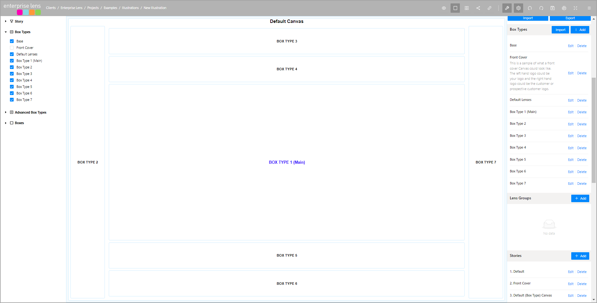 | 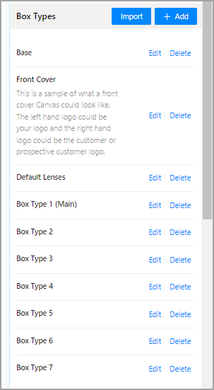 |

> The box names are designed to be amended and tailored to your needs.  We suggest that whatever name you change the Box name in the right hand menu to be - also change the Box name in the Illustration as it will be easier to manage.
>
> Hide the Box Types that you don't currently need, simply by unticking it from the Box Types menu on the left hand side.

## 2. Load From Excel

You are now able to load data directly from Excel without configuring your illustration.  This new mode will bring in all rows and columns of data.  It will create default lenses for all the columns of data that you import.  This mode can easily bring in several hundred rows of data. To use

* select the box you would like to populate from the Excel Table by clicking on it
* this will bring up the Edit Box form
* select the Export Child Boxes 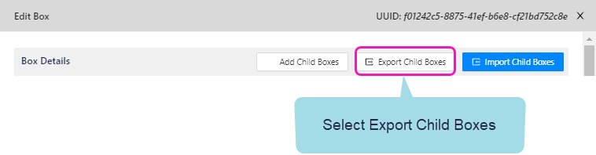
* this will create a new excel spreadsheet.  Fill this with the data that you want and then save the excel file and click on "Import Child Boxes" to load the  data from the Excel Spreadsheet into the selected box.

## 3. Dynamic Associations

You are able to create dynamic associations that are based on data values and so as data values changes so do their respective visual associations. This feature complements the existing bi-directional associations.  

### Attribute Values Lookup

This association type allows you to join on Attribute values that belong to a box.  If you want to join back, simply use the **Attribute Value Reverse lookup**.

> Data Driven Associations: As Data values change so will the underlying association.  eg if a Box belonged to a Region and then that same box changed its region attribute to something new - then association would also change to reflect the newly selected region.

### Names Lookup

This assoication type allows you to join on the Name of a Box to other boxes that have that value as an attribute eg Low, Medium, High.  If you want to join back simply use the **Name Reverse Lookup**.

> Data Driven Associations: As Data values change so will the underlying association.  eg if a Box name belonged to a Region and then that same box changed its Box name to something new - then association would also change to reflect the newly selected Box Name.

## 4. TypeWriter Mode

This mode allows you to add Boxes to an Illustration and determine when the display `wraps` and creates a new row of boxes.  For example.  if you set typewriter mode to be 6 then it will create an illustration with 6 Boxes per row.  When you click to add the 7th box, it will create a new row and put this new box on that row.

> **Typewriter Mode:**
>
> > the value can be amended at anytime and all boxes will be laid out to reflect the new value.
> >
> > This is a great feature to use when you are importing values from Excel.
>

To use:

* click on the box that you would like the TypeWriter mode to apply to - this will open the Edit Box Form

* enter the number of columns you would like to add before moving to the next row:

* 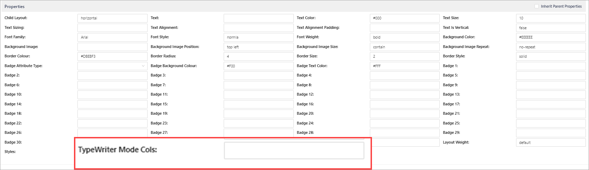

  

## 5. Lens Directories

There are over 150+ lenses that have been loaded into their respective libraries.  There are twelve (12) default lenses that are included in the Default Illustration and come free with the purchase of an Illustrator licence.

To accelerate your Illustration building, you are able to purchase access to all Lenses for a fee*.  New Lenses will be added throughout the year by Enterprise Lens and you will automatic access to those lenses.

## 6. URL Links

This feature allows you to link to your own internal corporate documents or documents.  To use:

* simply click on the box that you would like to add the URL to - this will open the Edit Box Form.
* enter the URL 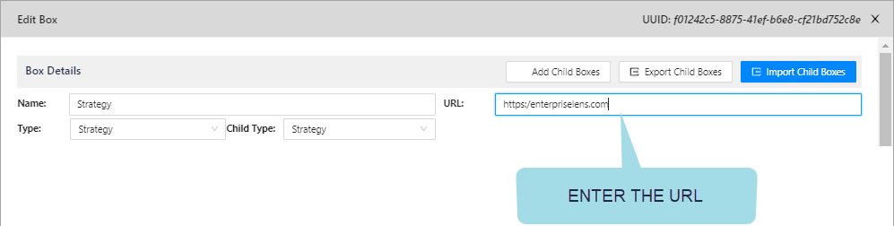
* When you click on this box in (**View Mode** ) - you will automatically navigate to this location.

## 7. Multi-Edit

You are now able to use the Multi-Edit feature to **Delete** boxes from an Illustration.  This can be useful for deleting Boxes from a recent import.  To use this new functionality, simply 

* select the multi-edit icon from the top menu bar:
* click on the boxes you would like to delete
* select the delete option from the top header menu 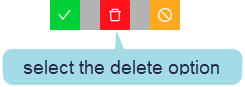

## 8. Branding

### New Logo

There is a new, contemporary logo created for this release:

### New Header bar logo and background colour

The style guide and look and feel of Enterpise Lens has also changed.  The dark colours have been replaced with varying shades of grey for the Header Menu and Edit Box Forms.  Where the left and right hand menus now incorporate white as their primary background colour.

## 9. Style Guide

There is a new Style Guide incorporate into Enterprise Lens.  Every Illustration has access to this style guide.  There is the flexibility to change this entire guide to better suit your corporate colour or branding.

The new additions include:

### Five (5) new selection for the Front Cover.

| Front Cover 1 (Yellow)                                | Front Cover 1 (Blue)                                  | Front Cover 1 (Grey)                                  | Front Cover 1 (Teal)                                  | Front Cover 5 (Lilac)                                 |
  | ----------------------------------------------------- | ----------------------------------------------------- | ----------------------------------------------------- | ----------------------------------------------------- | ----------------------------------------------------- |
  | 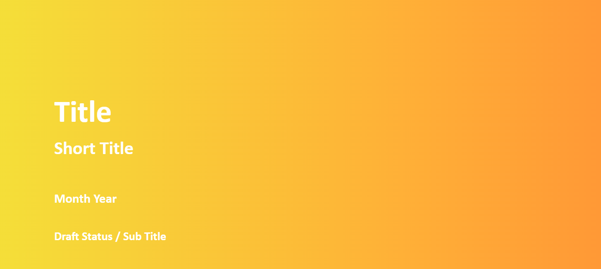 | 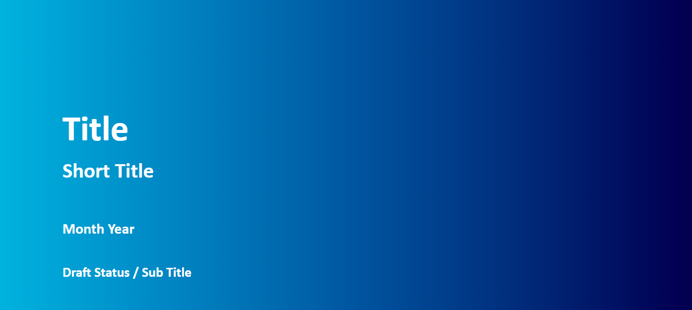 | 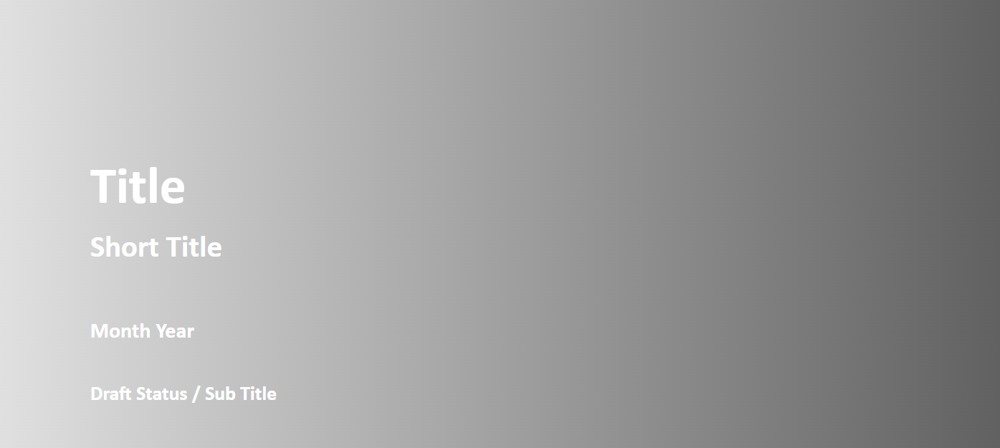 |  | 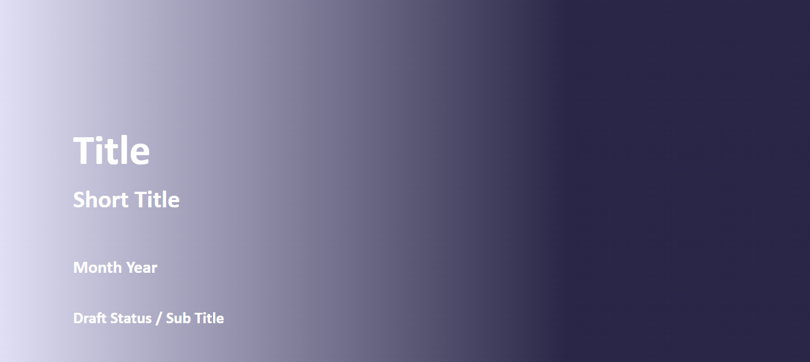 |

  > These covers can be selected from the the **Styles** section of the properties in the Edit Box Form.  Or you can edit and change these from the Box Styles in the JSON Editor in the right hand menu. 
  >
  > They appear by default whenever you create a new Illustration.

### Text Alignment

  | Alignment | For a lens that is wider than the text, you can align the text to the Left of a box | Lens Example                                          |
  | --------- | ------------------------------------------------------------ | :-----------------------------------------------------: |
  | Start     | For a lens that is wider than the text, you can align the text to the Left of a box |  |
  | End       | For a lens that is wider than the text, you can align the text to the right of a box | 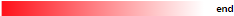 |
  | Centre    | For a lens that is wider than the text, you can align the text to be in the center of the box |  |

  > These values can also be placed inside a LensText Padding using the textAlignment attribute.

To accompany the text alignment, there is a **text padding** that ensures your lense values have a little space at the start or end of the Lens.  This default is set to 8 pixels (from the start and end) and can be changed at anytime be setting the number of pixels or by changing the internal attribute.

## 10. Enterprise Lens Codes

### Bug

[EL-648](https://enterpriselens.atlassian.net/browse/EL-648) Error Checking - If you select a Story and whilst on that Story decide to Delete it - EL Crashes

### Task

[EL-632](https://enterpriselens.atlassian.net/browse/EL-632) Update GitHub Actions from Node 12 to Node 16

### Improvement

[EL-667](https://enterpriselens.atlassian.net/browse/EL-667) New Default Illustration

### New Feature

[EL-513](https://enterpriselens.atlassian.net/browse/EL-513) Export filename to have the same name as the Illustration

[EL-640](https://enterpriselens.atlassian.net/browse/EL-640) Export to Excel \(Canvas & Child Box\) to support new URL feature

[EL-671](https://enterpriselens.atlassian.net/browse/EL-671) Create a new secured tenancy

