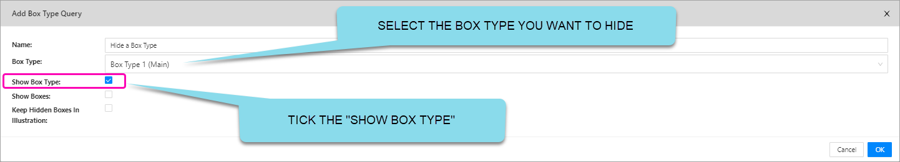

We are pleased to present Enterprise Lens 3.1.5. March 2024

This version of Enterprise Lens is aimed at improving usability, accelerating learning times and improves speed to value.  This is achieved through the addition of wizards, refinements and use of templates, support for "numbers" and story telling enhancements.

------

| TABLE OF CONTENTS                                            |
| ------------------------------------------------------------ |
| **[1. Association Wizard](#1-association-wizard)**           |
| **[2. Power Lens Wizard](#2-power-lens-wizard)**             |
| **[3. Templates](#3-templates)**                             |
| **[4. Support for Numbers](#4-support-for-numbers)**         |
| **[5. Easily Hide/Show Box Types](#5-easily-hide/show-box-types)** |
| **[6. Add New Boxes to a Story](#6-add-new-boxes-to-a-story)** |
| **[7. New Role Abilities (Exporting and Importing)](#7-new-role-abilities-exporting-and-importing)** |
| **[8. Jira Codes](#8-jira-codes)**                           |

## 1. Association Wizard

The Associations Wizard allows you to easily create new associations from any attribute within your Illustration.

This feature easily creates associations between your boxes in a few clicks, based on the attributes within boxes. It does this by creating child boxes with the names of attributes. 

**EXAMPLE:** You may want to create an association to all boxes based on their risk status of Low, Medium or High.

Simply click on the Box that you would like to populate with the `Risk` values.  This will bring up the Edit Box Form like below:

 

A new form will now appear titled "Create Automatic Filter Child Boxes". 

 

Already you can see that this creation process is simple:

| Options               | Description                                                  |
| --------------------- | ------------------------------------------------------------ |
| Source Box Type       | This is the ``Box Type`` that contains the ``Attributes`` you want to import as the children boxes. |
| Source Attribute Type | This is the ``Attribute`` you will select to import.  Every **choice** available in this attribute type will be shown below as a list.   Clicking "Add" at this stage will import the attributes from the attribute type as individual child boxes within the box you are editing. |

 

After selecting the Box Type that holds the attribute you want to `Filter` on - Let's select RISK from the drop down box

 

The "Values" for the Attribute "RISK" are now displayed, Click `Add` to have them inserted into your Illustration

 

By selecting `add` the distinct values found for the Risk Attribute within the Box Type 1 (Main) are inserted into the Illustration and the associations between the two box types are created.

In this example, if you were to hover over the new "**Low**" child box that is  created, you will see all ``Projects`` that have the `Risk` attribute **set to "Low"** and a new two-way association has been created.

 

## 2. Power Lens Wizard

Power Lens Wizard can be accessed in edit mode, towards the bottom of the right-hand menu, in a tab called "Power Lenses".

This new feature enables users to easily create Power Lenses without having to edit JSON code. Power Lens Wizard streamlines the process and makes it intuitive for beginners and experinced users alike.

Power Lens Wizard can be accessed in edit mode, towards the bottom of the right-hand menu, in a tab called "Power Lenses".

 

The process to follow is create the Power Lens first and then apply that Power Lens to a Power Lens Group.

To create a new Power Lens, click the **+ Add** button on the right-hand side. Then a form called **Add Power Lens** will appear.

 

In the image above, you will now select the `Add Attribute Query`.  This will present the `Add Attribute Query` Form.

| Options     | Description                                                  | Examples                                                     |
| ----------- | ------------------------------------------------------------ | ------------------------------------------------------------ |
| Name        | Specify the name for your new Power Lens.                    |                                                              |
| Description | You can add a meaningful description for your Power Lens, to help with internal organisation. |                                                              |
| Order       | Here you will specify the order of the Power Lens in relation to other Power Lenses on the left hand menu.  The higher the number, the lower the Power Lens is on the list. The lower the number, the higher the Power Lens is on the list. | A Power Lens of Order ``-1`` will be above the Power Lens with an Order of ``5``. |

You select the `Box Type` that holds the `Attribute`, determine the `Comparison Operator` you want to use and select the `Value` you would like to compare against, just as in the form below

  

Here you will be building a query based on the **attributes (and their values) within a box type**. This is useful for when you want to **compare specific attribute values** that boxes have and `remove` everything else from the screen

> Remember that the Parent Box Type must be different from the Children Box Type in a Power Lens.

> Comparison Operator examples:
>
> > `>`200 will have the impact of removing boxes from the screen where their value <= 200
> >
> > `<=` 200 will have the impact of removing boxes from the screen where their value > 200
> >
> > `<` 200 will have the impact of removing boxes from the screen where their value >= 200
> >
> > `!=` 200 will have the impact of removing boxes from the screen where their value != 200
> >
> > `==` 200 will have the impact of removing boxes from the screen where their value = 200

**EXAMPLE**: You wants to hide Projects that have the attribute ``Priority`` value of ``Low``. This example will be used below to explain the available options below:

| Options              | Description                                                  | Notes                                                        |
| -------------------- | ------------------------------------------------------------ | ------------------------------------------------------------ |
| Name                 | This is the name of the query you are building.  It can (and often will be) the same as your Power Lens name. | You should make the name seperate to the Power Lens name when there are multiple queries within the same Power Lens. |
| Box Types            | This is where you will select what box type **has the attributes** you want to base your query on. | Using our example, you would select ``Priority``.            |
| Attribute Type       | Here you specify the attribute you want to base your query on. |                                                              |
| Comparison Operator  | You will set the comparator that the ``Attribute Type`` and ``Value`` field will be compared against.  The boxes that satisfy this comparator will be hidden. The options present are: ``==``, ``!=``, ``true``, ``false``, ``includes``, ``>``, ``>=``, ``<``, and ``<=``. | Using our example, you would select ``==``  This is because we want to **hide** the boxes that have Priority **equal to "Low"**. |
| Value                | This is the field that the comparator will be used with, in conjunction with the ``Attribute Type``.  This needs to be a valid choice or entry that either an attribute in a box *could have* (choice-based attributes), or is set to (text-based attributes). | Using our example, you would enter "``Low``"  This way, in conjuction with the comparator the query looks at the attribute ``Priority``, for a match (``==``) with "``Low``". This way, the query will hide any ``Projects`` with a ``Priority`` of ``Low``. |
| Restrict By Box Type | Limit the attributes searched by the Query to *only* the box type you have specified. | This is only when you are comparing or using Box UUIDs as the ``Attribute Type``. |

## 3. Templates

This features is a refinement of templates and provides the ability to setup industry and company specific templates and facilitates simple replication. This allows access to a library of templates that are simple to access and can be tailored to new opportunities, improving the speed to respond to new business. 

This new functionality is found by editing the **Client**, in the right-hand side of the form. Click Edit to open the `Edit Client` form.

 

When you click "Edit" it will present the Client Details form.  Use the drop down arrow to provide a list of Template Clients you can choose from (this will be determined by your access privileges).  

 

After selecting a `Template Client`, (we selected `Template` from the example above) - all `Template Projects (Directories) that belong to that Client will appear in the drop down list in the `Template Project` area 

  

Select a `Template Project` and all the Template Illustration that are part of that Template Project will present themselves whenever you create `ANY` new Illustration for that Client. 

> TIP: Every Client can have their `OWN` Templates to Choose from or you can build a central repository.

## 4. Support for 'Numbers'

You are now able to create attributes with a **number** value type, this can be decimal, negative **or** positive. 

This is useful in a number of cases where:

- You need to build Power Lenses to hide or show boxes that meet a certain numerical criteria
  - i.e. A new Power Lens that shows all Projects greater than $0 value

- You may need to have a formatted version of the number for presentation purposes eg separate the value displayed as a lens, from the value used for Lens calculations
  - i.e. You have two attributes for "Amount (Text Based)", as below. One is formatted as TEXT, and the other is a **number value type**. This is so you have an attribute to perform calculations on, such as greater than (`>=`), less than (`<=`), etc with Power Lenses.

If you edit the "Amount" Attribute (that has order 2 in the example above) 

 

You can use the arrows to `increase` or `decrease` the value in the Amount attribute above.

> Note: The Number value type can now be used in Power Lenses to provide <,comparisons

## 5. Easily Hide/Show Box Types

This new feature enables users to easily easily hide a Box Type that is part of a Story.  To use this feature, it also uses the concept of Power Lenses and Power Lens groups.

Power Lens Wizard can be accessed in edit mode, towards the bottom of the right-hand menu, in a tab called "Power Lenses".

 

The process to follow is create the Power Lens first and then apply that Power Lens to a Power Lens Group.

To create a new Power Lens, click the **+ Add** button on the right-hand side. Then a form called **Add Power Lens** will appear.

 

In the image above, you will now select the `Add Box Type Query`.  This will present the `Add Box Type Query` Form.

Simply select your Box Type and Tick `Show Box Type` like below.

 

In this form, you are building a query that the Power Lens will carry out, based on a **box type**. This feature will enable users to **show OR hide** <u>a full set of box types</u>. Below are the options to create such a query:

| Options                           | Description                                                  | Examples                                                     |
| --------------------------------- | ------------------------------------------------------------ | ------------------------------------------------------------ |
| Name                              | This is the name of the query you are building.  It is automatically set the same name as your Power Lens name.  **TIP:** When there are multiple queries within the same Power Lens, you should make the name different to the Power Lens name. |                                                              |
| Box Types                         | Here you select what box type you specifically want to hide or affect. |                                                              |
| Show Box Type                     | This will hide the box type - that you selected above - from your illustration.    If it does have a fixed percentage, then this feature will only hide the boxes, but it will not remove the space that they used to occupy. | If you want the remaining box types to occupy the space that the hidden box type took up, then you have to make sure that the **Layout Weight** of your box types is set to **default** and doesn't have a fixed percentage.   Note that even though you have hidden a box type, this feature respects any associations that have been created with that box type. |
| Show Boxes                        | This will show any boxes in the same box type. This applies when you have boxes hidden via the Left Hand menu. | A box type called "Project Base", might have child boxes with box type "Projects". All of these boxes will be shown |
| Keep Hidden Boxes in Illustration | This will make the selected box type and it's child boxes invisible. However, it maintains the space that they used to occupy.  This is useful for when you want to hide a box type, but want to keep the layout of the illustration **the same**. |                                                              |

## 6. Add new Boxes to a Story

In previous versions of Enterprise Lens, when you created a `Story`, all the Boxes from a Box Type that were part of the Story at the time were saved.  You are now able to create new boxes which will **always be available** across all saved states in an Illustration. 

Previously, any boxes you add to a saved state (story) would not carry through to new stories.

## 7. New Role Abilities (Exporting and Importing)

With this new release comes more granular permissions on who can import or export child boxes. You can add the following ``Abilities`` to roles:

- ImportChildBoxes
- ExportChildBoxes

When you open the Edit Box form, for ANY Box, you will be presented with two new roles at the top of the form.  

>  **TIP: You typically Export and Import from the same box within the Illustration**

**Please note** that the example also has ``Create Automatic Filters`` and ``Add Child Boxes`` in the `Edit Box form` , but they may not be present as it depends on your access privileges.

#### Export Child Boxes

To export the children box of a parent, simply click on a Box and select `Export Child Boxes`.  This will present the `Export Child Boxes to Excel` form:

When you click **Export **, it will generate an Excel Spreadsheet that will look like this:

**Functionality:**

If you add new rows in Excel (from row E3 downward), they will be treated as new boxes within the Illustration.

If you add new columns, they will be treated as new attributes. (If you delete the column name in row 2 above then that column will NOT be imported)

You can edit the existing boxes and their attribute values as you please.

Once you have finished modifying the Excel file, save it and load it into the illustration via **Import Child Boxes**.

#### Import Child Boxes

To Import from Excel, simply click on a box within the Illustration that you just used the Export Child Boxes functionality and click `Import Child Box`.  

 

Now you can drag and drop your excel file into the Box or click within the blue dashed border and navigate and find your excel spreadsheet (by default this is the downloads directory in your personal )

When you click **Import**, it will load the Excel data directly into the Illustration.

[Top](#enterprise-lens-version-3.1.5-release-notes)

## 8. Jira Codes

### Bugs

[EL-674](https://enterpriselens.atlassian.net/browse/EL-674) View and Edit mode Horizontal and Vertical spacing would default to 2 pixels.  Now it can be set to 0 pixels

[EL-681](https://enterpriselens.atlassian.net/browse/EL-681) On a failed login the user cookies were not being cleared

[EL-527](https://enterpriselens.atlassian.net/browse/EL-527) When you select "Select from Import Types" on the Edit-Box form nothing happened

### New Features

[EL-328](https://enterpriselens.atlassian.net/browse/EL-328) Ability to set a Number type against a lens.  Till now, everything was treated as a string

[EL-633](https://enterpriselens.atlassian.net/browse/EL-633) You can now add pre-text and post-text to an lens. eg "FY2023" $23M or 20 "sqm" 

[EL-635](https://enterpriselens.atlassian.net/browse/EL-635) Power Lens Editor - similar functionality to Lens Editor but more powerful

[EL-680](https://enterpriselens.atlassian.net/browse/EL-680) Two additional security roles have been created for importing and exporting child boxes

[EL-682](https://enterpriselens.atlassian.net/browse/EL-681) Ability to create an Illustration from your own custom Template(s).  This is in addition to the Default Template

[EL-683](https://enterpriselens.atlassian.net/browse/EL-683) Ability to easily include new boxes AFTER a Story has been created and the state is saved

[EL-676](https://enterpriselens.atlassian.net/browse/EL-676) Create a new Box Type and dynamic associations from the attributes of another Box Type

[EL-677](https://enterpriselens.atlassian.net/browse/EL-677) If an imported Lens has multiple values - ability to create a new lens that is a Choice based lookup on the distinct values

