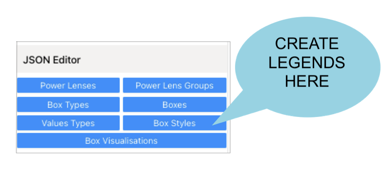
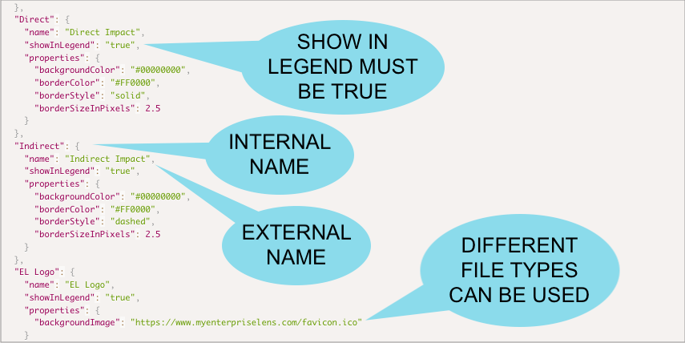
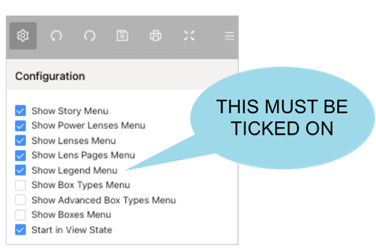
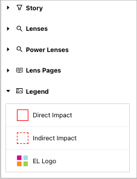
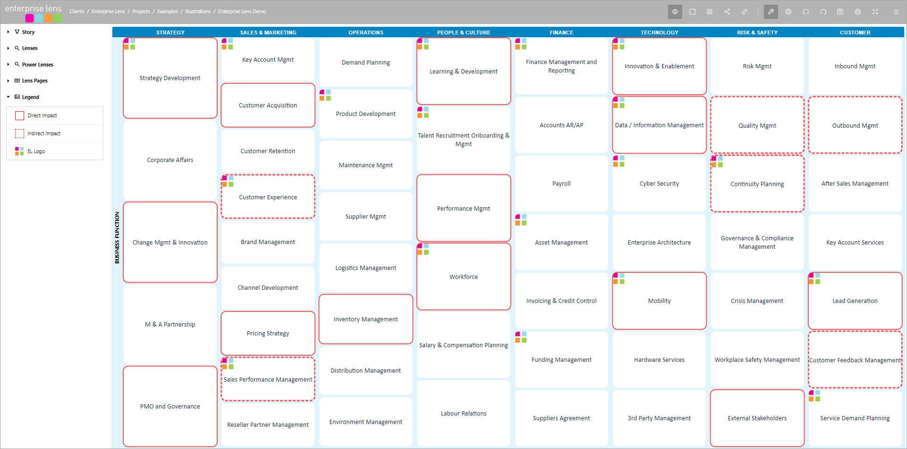
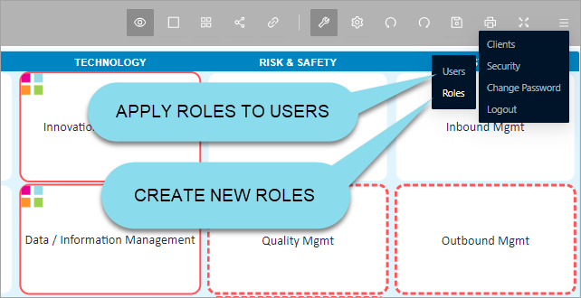
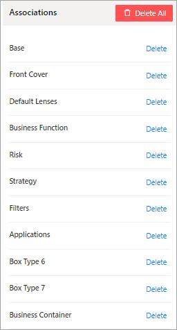

We are pleased to present Enterprise Lens 3.1.6. May 2024

This release features two new improvements for Enterprise Lens, legends and a new role. Both of which are aimed at improving the product's usability and clarity. 

------

| TABLE OF CONTENTS              |
| ------------------------------ |
| **[1. Legends](#1-legends)**   |
| **[2. New Role](#2-new-role)** |

## 1. Legends

Legends are an easy way to communicate what a Lens means. They provide a shortcut in understanding what a Lens is expressing when text is not appropriate.

**EXAMPLE:** You may want to use a legend to show which Lenses indicate a direct or an indirect impact to your business.

>  Note: Your legends should reflect the characteristics (i.e. colour, line style etc.) of your Lenses.

Legends are created in the ``Box Styles`` section in the the Right Hand menu under the JSON Editor, see below. 

 

This is example JSON code used that created a Legend entry.

 

Different file types (such as png, jpeg, ico and gif) can be used within legends to show icons rather than a simple box border colour or background colour etc. This allows different types of Lenses, such as a logo, to be replicated in the legend. 

> Note: The properties of a legend can be manipulated. This means that characteristics (i.e. colour, border style, border size and background colour) can be changed to mimic the Lens.

In order to view your legend in the Right Hand menu, you must tick ``Show Legend Menu``, located at the top of the Left Hand Menu, as below.

 

After selecting ``Show Legend Menu``, you should be able to view the legends you have created in the Left Hand Menu 

 

To provide some context, here is an illustration with a Lens that shows the impact that a project has on a business. The red solid border indicates that there is a direct impact on a business function from the program of work, where as the red dashed border indicates an indirect impact. We have also included a logo example to show how it can be used within a legend.

 

## 2. New Role

With the addition of data driven lookups (such as the Name value and the Attribute value lookup), the need for access to the `Assocations menu` has decreased. The new role, IllustrationBulkAssociationEdit, allows you to hide the `Assocations menu`, as to free up space in the Right Hand menu.

> Note: The IllustrationBulkAssociationEdit role must be included in the group role that you would like to be able to delete Associations.

The `Assocations menu` is located at the bottom of the Right Hand Menu.

 

This entire section can be removed with the new role.

To access Roles within Enterprise Lens, simply click on the 3 dashes in the top right hand corner and select Security  -> Roles, as below.

 

#### New Feature

[EL-697](https://enterpriselens.atlassian.net/browse/EL-697) Legend - shortcut in understanding what a Lens is expressing when text is not appropriate.

#### Improvement

[EL-308](https://enterpriselens.atlassian.net/browse/EL-308) New role to remove the delete Associations menu from the Right Hand menu

