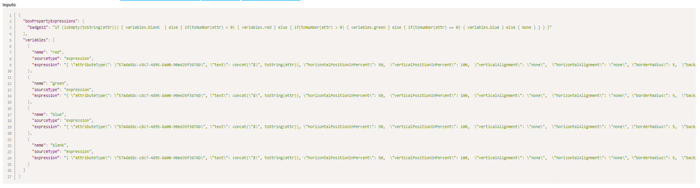

# Conditional Formatting
As you start to flesh out your illustrations, you will find that you want to represent pieces of information in ways that aren't just literal to what they are. Some common examples include:
- Ageing accounts receivable from customers according to their respective baskets, by colour coding each customers' box.
- Inventory levels for products, with a colour scheme to indicate level of depletion.
- Indicators to show per project whether they meet X amount of auditing standards or not.
- Customer satisfaction per sales representative, represented as a coloured percentage rating according to internal standards.

By the end of this guide, you will have mastered what it takes to conditionally format your illustration, to make it truely driven by the data you have.

:::danger Intermediary understanding required!

Make sure you've completed our prior introductory training on Lenses and Attributes, and are comfortable with all aspects of our training material. This topic assumes you have already completed training and are **proficient** with the aforementioned topics.

:::

## What it is
Conditional Formatting in Enterprise Lens allows you to represent data captured in the **attributes** of your boxes, visually **according to set criteria** that you can define. You will be utilising Enterprise Lens' powerful Render Engine to define criteria and display information accordingly.

## Get Started
In our example, we will be displaying the ``Project Value`` attribute of ``Projects``, and colour coding them according to whether provide a positive value (above $0), no value ($0), or a loss (less than $0) to the example firm.

First we will open the ``Projects`` box type, navigate to the existing **Project Value** attribute and add a Render Function if there isn't one already. If there is, edit it instead.
  - Change the ``Type`` to ``Set Box Properties From Expression``

The input will define the following two things:
- Conditions for various outputs (badge expression)
- The outputs themselves (variables)

This is what it looks like:



Let's break each element down to better understand what we are doing!

### The Expression
The expression is the most important part of Conditional Formatting, as it tells the Render Engine what to display, according to what criteria. In the example above, our expression is:

```
  "boxPropertyExpressions": {
    "badge32": "if (isEmpty(toString(attr))) { variables.blank } else { if(toNumber(attr) < 0) { variables.red } else { if(toNumber(attr) > 0) { variables.green } else { if(toNumber(attr) == 0) { variables.blue } else { None } } } }"
  },
```

The expression is made up of 'IF ELSE' statements, these statements look to see whether a condition is met and then displays a specific output. Below is the expression expanded, you are encouraged to create expressions expanded like this first. Once you finalise your expressions, you can just backspace the extra lines/spaces to get the result above.

```
1. if (isEmpty(toString(attr))) {
2.     variables.blank 
3. } else {
4.     if (toNumber(attr) < 0) {
5.         variables.red
6.     } else {
7.         if (toNumber(attr) > 0) {
8.             variables.green
9.         } else {
10.             if (toNumber(attr) == 0) {
11.                 variables.blue
12.             } else {
13.                 None
14.             }
15.         }
16.     }
17. }
```

- **Lines 1 to 3**, looks at the attribute to see if IS EMPTY __after__ converting it to a STRING.
  - A string is a series of characters (like a, b, c, d or 1, 2, 3, 4) put together.
  - We convert the attribute (``Project Value``) into a STRING so the Render Engine can read the attribute to see if it is empty.
  - If it IS empty, it displays the BLANK variable, which we will explain later.
- **Lines 4 to 6**, looks look at the attribute to see if if LESS than zero __after__ converting it to a NUMBER, if it isn't blank (as defined in lines 1-3).
  - We are converting the attribute to a number, so then we can compare it to zero.
  - If it IS less than zero, it displays the RED variable, which we will explain later.
- **Lines 7 to 9**, looks at the attribute to see if if GREATER than zero __after__ converting it to a NUMBER, if it isn't blank or less than zero (as defined in lines 1-6).
  - We are converting the attribute to a number, so then we can compare it to zero.
  - If it IS greater than zero, it displays the GREEN variable, which we will explain later.
- **Lines 10 to 12**, looks at the attribute to see if if EQUAL TO zero __after__ converting it to a NUMBER, if it isn't blank, less than zero, or greater than zero (as defined in lines 1-9).
  - We are converting the attribute to a number, so then we can compare it to zero.
  - If it IS equal to zero, it displays the BLUE variable, which we will explain later.
- **Line 13**, if none of the previous conditions are met, it returns nothing. :(
  - This shouldn't ever happen, given we defined a condition for every possible outcome - but we include it just in case something is wrogn with our data (i.e. it isn't an number).

#### Brackets
You will notice from line 14-17, there are brackets per line. Each bracket corresponds to each IF. If you count how many IFs are in the statement, you will notice there are four. Four IFs equals to four brackets!

#### Operators
You will notice that we used symbols to compare the attribute to 0. Below is a list of all operators you can use.

- ``<`` means LESS THAN.
  - ``<=`` is a version of this that means EQUAL OR LESS THAN.
- ``>`` means GREATER THAN.
  - ``>=`` is a version of this that means EQUAL OR GREATER THAN.
- ``=`` means EQUAL TO.
  - ``==`` is a version of EQUALS to, that doesn't look at it from a mathematical perspective, rather a literal one. We used it in our example above, in that example it means "Is the attribute literally the number 0?". 
  - If we wanted to (and we could have) check if the attribute just equaled zero, we only need to use one equals sign.

### (attr)
This is how you reference the attribute, in this case the ``Project Value``.

### The Variables
In the previous section, we saw how according to each condition a variable was displayed in the expression. Each variable can define what the box should look like. Here are the variables we are using to format the Project Value:

```
  "variables": [
    {
      "name": "red",
      "sourceType": "expression",
      "expression": "{ \"attributeType\": \"57ada58c-c8c7-4d95-8a00-90e635f3876b\", \"text\": concat(\"$\", toString(attr)), \"horizontalPositionInPercent\": 50,  \"verticalPositionInPercent\": 100,  \"verticalAlignment\": \"none\",  \"horizontalAlignment\": \"none\", \"borderRadius\": 5,  \"backgroundColor\": \"#E60D2E00\",  \"textColor\": \"#FF0000\",  \"width\": 65, \"height\": 16, \"fontFamily\": \"Arial\", \"textSizeInPixels\": 12 }"
    },
    {
      "name": "green",
      "sourceType": "expression",
      "expression": "{ \"attributeType\": \"57ada58c-c8c7-4d95-8a00-90e635f3876b\", \"text\": concat(\"$\", toString(attr)), \"horizontalPositionInPercent\": 50,  \"verticalPositionInPercent\": 100,  \"verticalAlignment\": \"none\",  \"horizontalAlignment\": \"none\", \"borderRadius\": 5,  \"backgroundColor\": \"#202A4500\",  \"textColor\": \"#00c853\",  \"width\": 65, \"height\": 16, \"fontFamily\": \"Arial\", \"textSizeInPixels\": 12 }"
    },
    {
      "name": "blue",
      "sourceType": "expression",
      "expression": "{ \"attributeType\": \"57ada58c-c8c7-4d95-8a00-90e635f3876b\", \"text\": concat(\"$\", toString(attr)), \"horizontalPositionInPercent\": 50,  \"verticalPositionInPercent\": 100,  \"verticalAlignment\": \"none\",  \"horizontalAlignment\": \"none\", \"borderRadius\": 5,  \"backgroundColor\": \"#202A4500\",  \"textColor\": \"#0000FF\",  \"width\": 65, \"height\": 16, \"fontFamily\": \"Arial\", \"textSizeInPixels\": 12 }"
    },
    {
      "name": "blank",
      "sourceType": "expression",
      "expression": "{ \"attributeType\": \"57ada58c-c8c7-4d95-8a00-90e635f3876b\", \"text\": concat(\"$\", toString(attr)), \"horizontalPositionInPercent\": 50,  \"verticalPositionInPercent\": 100,  \"verticalAlignment\": \"none\",  \"horizontalAlignment\": \"none\", \"borderRadius\": 5,  \"backgroundColor\": \"#202A4500\",  \"textColor\": \"#0000FF\",  \"width\": 65, \"height\": 16, \"fontFamily\": \"Arial\", \"textSizeInPixels\": 12 }"
    }
  ]
```

- All of these variables are identical, except for a different text colour (``\"textColor\"``). 
  - All these options should be present, therefore we recommend just copying and pasting previous variable expressions and making appropriate changes.
- You can define variables in expressions using the following notation: ``variables.name``, replacing "name" with the name of the variable.
- You will notice that there are several backslashes in each variable definition. They **must** be used before every quotation mark to avoid errors.
- The ``attributeType`` should be the UUID of the attribute, which is found in the **same Render Function editor**, on the top left title.

#### Options
Most of these options are self explanatory, however a select few which are important are being explained below.
- ``attributeType``, the UUID of the attribute that is being displayed.
- ``text``, the display text for the chosen variable.
  - In all variables, it is ``concat(\"$\", toString(attr))``
    - This means a dollar sign is in front of the attribute, AFTER it is turned into a string (a list of characters).
    - We recommend copying and pasting this syntax for ease of use.
- ``horizontalPositionInPercent``, how far right the text should be. 
  - In all variables, it is set to 50, to indicate the text should be positioned in the middle of the box on the horizontal axis.
- ``verticalPositionInPercent``, how close to the text should be. 
  - In all variables, it is set to 10, to indicate that the text should be positioned at the bottom of each box on the vertical axis.
  
  
:::note Colour

Any colour (color) option, i.e. ``textColor`` or ``backgroundColor`` must be expresseed as a HEX code, with the hashtag included. Adding ``00`` to the end of any HEX turns it fully transparent.

:::

### Displaying Conditional Formatting
To test whether Conditional Formatting works, we recommend enabling the attribute from the **Advanced Box Types Menu** on the **Left Hand Menu** and ensuring it works. 

Once you are happy with how it displays, turn the attribute off and make an Lens, mapping the Lens to the attribute directly (given that is where you setup the render function).

## All done!
Great job on following us this far, we understand that writing your own render function is tedious - that's why we recommend copying and pasting the template below, editing it to your liking.

Until next time! :)

```
{
  "boxPropertyExpressions": {
    "badge32": "if (isEmpty(toString(attr))) { variables.blank  } else { if(toNumber(attr) < 0) { variables.red } else { if(toNumber(attr) > 0) { variables.green } else { if(toNumber(attr) == 0) { variables.blue } else { None } } } }"
  },
  "variables": [
    {
      "name": "red",
      "sourceType": "expression",
      "expression": "{ \"attributeType\": \"XXXXXXXXXXXXXXXXXXXXXXXXXXXXXXXXXXXXX\", \"text\": concat(\"$\", toString(attr)), \"horizontalPositionInPercent\": 50,  \"verticalPositionInPercent\": 100,  \"verticalAlignment\": \"none\",  \"horizontalAlignment\": \"none\", \"borderRadius\": 5,  \"backgroundColor\": \"#E60D2E00\",  \"textColor\": \"#FF0000\",  \"width\": 65, \"height\": 16, \"fontFamily\": \"Arial\", \"textSizeInPixels\": 12 }"
    },
    {
      "name": "green",
      "sourceType": "expression",
      "expression": "{ \"attributeType\": \"XXXXXXXXXXXXXXXXXXXXXXXXXXXXXXXXXXXXX\", \"text\": concat(\"$\", toString(attr)), \"horizontalPositionInPercent\": 50,  \"verticalPositionInPercent\": 100,  \"verticalAlignment\": \"none\",  \"horizontalAlignment\": \"none\", \"borderRadius\": 5,  \"backgroundColor\": \"#202A4500\",  \"textColor\": \"#00c853\",  \"width\": 65, \"height\": 16, \"fontFamily\": \"Arial\", \"textSizeInPixels\": 12 }"
    },
    {
      "name": "blue",
      "sourceType": "expression",
      "expression": "{ \"attributeType\": \"XXXXXXXXXXXXXXXXXXXXXXXXXXXXXXXXXXXXX\", \"text\": concat(\"$\", toString(attr)), \"horizontalPositionInPercent\": 50,  \"verticalPositionInPercent\": 100,  \"verticalAlignment\": \"none\",  \"horizontalAlignment\": \"none\", \"borderRadius\": 5,  \"backgroundColor\": \"#202A4500\",  \"textColor\": \"#0000FF\",  \"width\": 65, \"height\": 16, \"fontFamily\": \"Arial\", \"textSizeInPixels\": 12 }"
    },
    {
      "name": "blank",
      "sourceType": "expression",
      "expression": "{ \"attributeType\": \"XXXXXXXXXXXXXXXXXXXXXXXXXXXXXXXXXXXXX\", \"text\": concat(\"$\", toString(attr)), \"horizontalPositionInPercent\": 50,  \"verticalPositionInPercent\": 100,  \"verticalAlignment\": \"none\",  \"horizontalAlignment\": \"none\", \"borderRadius\": 5,  \"backgroundColor\": \"#202A4500\",  \"textColor\": \"#0000FF\",  \"width\": 65, \"height\": 16, \"fontFamily\": \"Arial\", \"textSizeInPixels\": 12 }"
    }
  ]
}
```

:::warning Note the badge number
You may be using badge32 already and need to change it to another badge number. You can check by opening the **Box Types** section in the JSON Editor on the Right Hand Menu, doing Control + F and searching for ``badge32``. 
:::


